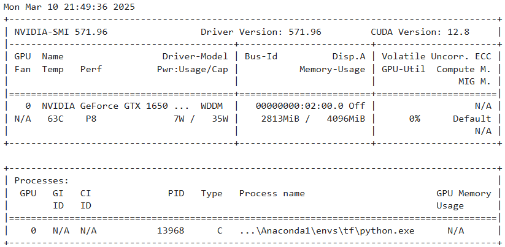
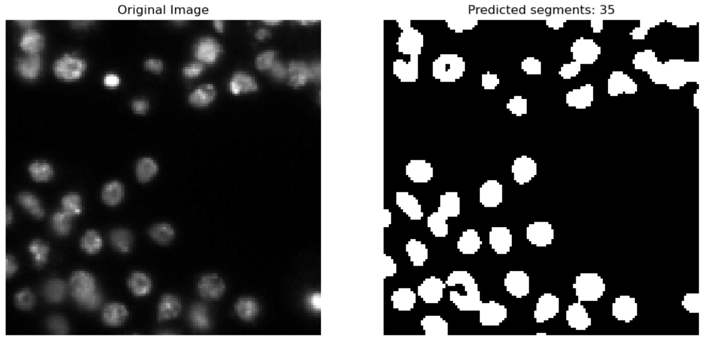

# CNN-Segmentation-UNet
 using U-Net model for medical Segmentation with about 70% accuracy in IOU with 670 training images
 
 this trained model by little fine tunning can be used to find and count metallurgical defects
 ## the image of my laptop system i used in this projects
 
 ## sample result
 

 * more pictures are shown in segmentation.ipynb file
 * size to be clone is 187 MB
 * to get the dataset and further info plz get in touch with me
